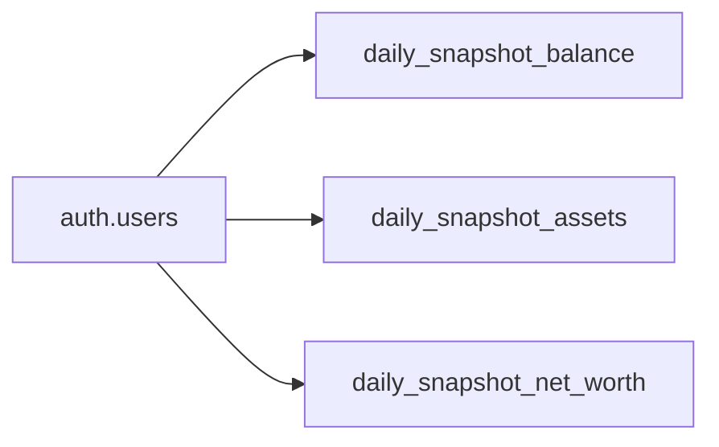

# Data Model: Sync Snapshot Tables

**Branch**: `005-sync-snapshot-tables` | **Date**: 2026-02-19

## Entity: daily_snapshot_balance

| Field              | Type          | Nullable | Notes                       |
| ------------------ | ------------- | -------- | --------------------------- |
| id                 | UUID (PK)     | NO       | Auto-generated              |
| user_id            | UUID (FK)     | NO       | References auth.users       |
| snapshot_date      | DATE          | NO       | Part of UNIQUE with user_id |
| total_accounts_egp | DECIMAL(15,2) | NO       | Total balance in EGP        |
| created_at         | TIMESTAMPTZ   | NO       | DEFAULT NOW()               |

**Removed**: `breakdown` JSONB column  
**Constraint**: `UNIQUE(user_id, snapshot_date)` (re-added)  
**WatermelonDB Model**: `DailySnapshotBalance`

## Entity: daily_snapshot_assets

| Field            | Type          | Nullable | Notes                       |
| ---------------- | ------------- | -------- | --------------------------- |
| id               | UUID (PK)     | NO       | Auto-generated              |
| user_id          | UUID (FK)     | NO       | References auth.users       |
| snapshot_date    | DATE          | NO       | Part of UNIQUE with user_id |
| total_assets_egp | DECIMAL(15,2) | NO       | Total assets in EGP         |
| created_at       | TIMESTAMPTZ   | NO       | DEFAULT NOW()               |

**Removed**: `breakdown` JSONB column  
**Constraint**: `UNIQUE(user_id, snapshot_date)` (re-added)  
**WatermelonDB Model**: `DailySnapshotAssets`

## Entity: daily_snapshot_net_worth

| Field           | Type          | Nullable | Notes                       |
| --------------- | ------------- | -------- | --------------------------- |
| id              | UUID (PK)     | NO       | Auto-generated              |
| user_id         | UUID (FK)     | NO       | References auth.users       |
| snapshot_date   | DATE          | NO       | Part of UNIQUE with user_id |
| total_accounts  | DECIMAL(15,2) | NO       | DEFAULT 0                   |
| total_assets    | DECIMAL(15,2) | NO       | DEFAULT 0                   |
| total_net_worth | DECIMAL(15,2) | NO       | DEFAULT 0                   |
| created_at      | TIMESTAMPTZ   | NO       | DEFAULT NOW()               |

**Constraint**: `UNIQUE(user_id, snapshot_date)` (added)  
**WatermelonDB Model**: `DailySnapshotNetWorth`

## Relationships

All three tables have a many-to-one relationship with `auth.users` (one user has
many daily snapshots).

## Sync Characteristics

| Attribute | Value                                                 |
| --------- | ----------------------------------------------------- |
| Direction | Pull-only (server → client)                           |
| Filtering | `user_id` scoped + `created_at` for incremental       |
| Retention | 90 days locally                                       |
| Conflict  | None (read-only on client)                            |
| Special   | No `updated_at`/`deleted` — uses custom pull function |
